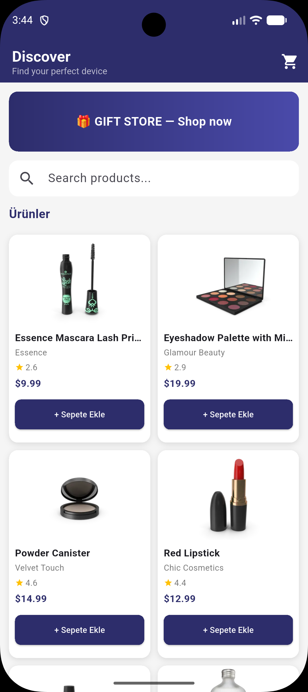
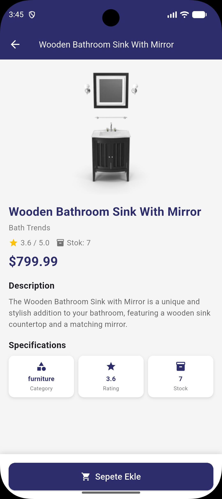
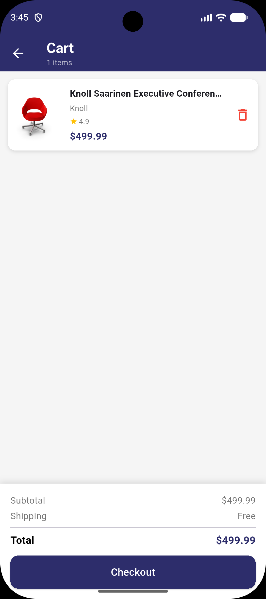
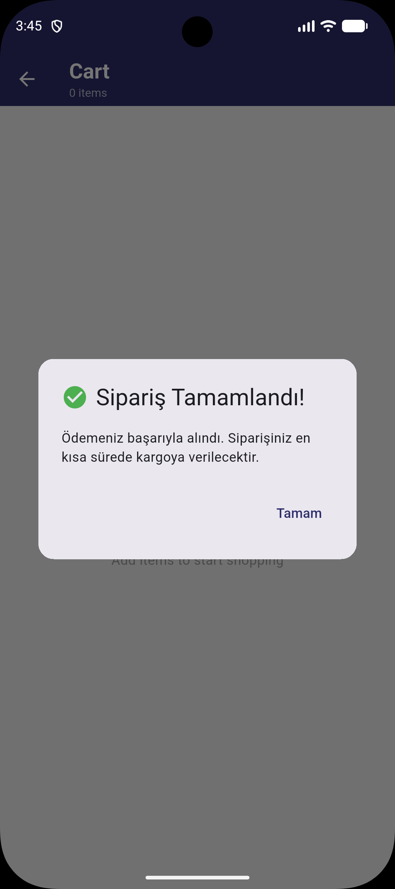

# Mini Katalog Uygulaması

Flutter ile geliştirilmiş modern bir e-ticaret katalog uygulaması.

## Özellikler

- DummyJSON API'den gerçek zamanlı ürün listeleme
- Anlık ürün arama
- Ürün detay sayfası (açıklama, rating, stok bilgisi)
- Sepete ürün ekleme ve çıkarma
- Sepet verisi local storage ile saklanır (uygulama kapansa bile kaybolmaz)
- Checkout simülasyonu

## Ekran Görüntüleri

| Ana Sayfa                          | Detay Sayfası                    | Sepet                          | Siparis                              |
| ---------------------------------- | -------------------------------- | ------------------------------ | ------------------------------------ |
|  |  |  |  |

## Kullanılan Teknolojiler

- Flutter 3.44.4
- Dart
- http paketi (REST API istekleri)
- shared_preferences paketi (local storage)

## Proje Yapısı

lib/
├── models/
│ └── product.dart
├── screens/
│ ├── home_screen.dart
│ ├── detail_screen.dart
│ └── cart_screen.dart
├── services/
│ ├── api_service.dart
│ └── local_storage_service.dart
├── widgets/
│ └── product_card.dart
└── main.dart

## Kurulum ve Çalıştırma

1. Repoyu klonla:

```bash
git clone https://github.com/KULLANICI_ADIN/mini-katalog-app.git
```

2. Proje klasörüne gir:

```bash
cd mini-katalog-app
```

3. Bağımlılıkları yükle:

```bash
flutter pub get
```

4. Uygulamayı çalıştır:

```bash
flutter run
```

## Gereksinimler

- Flutter SDK >= 3.44.4
- Android SDK (emulator veya fiziksel cihaz)
- Internet bağlantısı (API verileri için)

## API

Bu proje DummyJSON (https://dummyjson.com) API'sini kullanmaktadır. Gerçek bir e-ticaret altyapısını temsil etmez, eğitim amaçlıdır.

## Geliştirici

Mustafa AYYILDIZ - Yazılım Geliştirme Egitimi
Software Persona
